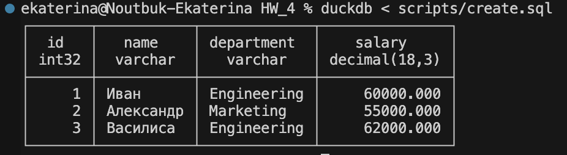

## Знакомство с DuckDB СУБД (модель СУБД Relational)

### История развития DuckDB


`DuckDB` – это аналитический SQL-движок, который быстро набирает популярность, о чем свидетельствует его впечатляющая статистика:

* `1,7` миллиона загрузок в месяц на PyPI
* `16 400` звезд на GitHub, достижение такого же интереса, как у Postgres, за половину времени


`DuckDB` — это работа Марка Раасвельдта и Ханнеса Мюлейзена написанная на C++ и работающая как отдельный двоичный файл. Даже сейчас разработка идет очень активно(у них на [гитхабе](https://github.com/duckdb/duckdb) есть совсем свежие коммиты): количество коммитов в репозитории GitHub удваивается почти каждый год с момента его запуска в 2018 году. `DuckDB` использует синтаксический анализатор `SQL PostgreSQL`, механизм регулярных выражений `RE2` от `Google` и оболочку `SQLite`.

Разница между `SQLite` и `DuckDB` заключается в том, что `SQLite` - это встроенная онлайн-обработка транзакций `(OLTP)`, тогда как `DuckDB` - это встроенная онлайн-аналитическая обработка (OLAP).

Популярность `DuckDB` растет, о чем свидетельствует тенденция поиска в `Google`. `DuckDB` - один из тех инструментов, которые люди только и ждут, чтобы найти; как только они его найдут, это изменит их работу. А такие компании, как `Hex` и `deepnote`, уже используют `DuckDB` для поддержки своего программного обеспечения.

### Инструменты для взаимодействия с DuckDB

* Можно взаимодействовать с помощью `python`, для этого необходимо выполнить `pip install duckdb` (потом пишем скрипт и радуемся). Также есть библиотеки для `R`, `Java`, `Node.js` 

* C помощью обычной консоли(`brew install duckdb`)

* `DuckDB` поддерживает `Apache Arrow`, что позволяет эффективно обмениваться данными между `DuckDB` и другими инструментами и библиотеками, поддерживающими `Arrow`

### Какой database engine используется в вашей СУБД?

`DuckDB` использует собственный `database engine`, который разработан специально для работы с данными в аналитическом контексте. Этот `engine` оптимизирован для выполнения запросов `SQL` и обработки данных. Он обеспечивает высокую производительность и эффективное использование ресурсов, что делает `DuckDB` привлекательным выбором для аналитических и исследовательских задач.

### Как устроен язык запросов в вашей СУБД? Разверните БД с данными и выполните ряд запросов. 

`DuckDB` поддерживает стандартный `SQL`, включая большинство основных операторов и функций. Можно создавать таблицы, вставлять данные, выполнять выборки, группировать, сортировать и многое другое

Для начала установим `CLI DuckDB`


Дальше созданим директорию `scripts` и в ней файл `create.sql`

```
-- Создание таблицы
CREATE TABLE employees (
    id INTEGER PRIMARY KEY,
    name VARCHAR,
    department VARCHAR,
    salary DECIMAL
);

-- Вставка данных
INSERT INTO employees (id, name, department, salary)
VALUES (1, 'Иван', 'Engineering', 60000),
       (2, 'Александр', 'Marketing', 55000),
       (3, 'Василиса', 'Engineering', 62000);

-- Выборка данных
SELECT * FROM employees;
```

Запустим через `CLI DuckDB`



Выполним несколько запросов

```
-- Выборка с агрегацией и группировкой
SELECT department, AVG(salary) AS avg_salary
FROM employees
GROUP BY department;

-- Подзапрос
SELECT name, department
FROM employees
WHERE salary > (SELECT AVG(salary) FROM employees);
```


### Распределение файлов БД по разным носителям?

`DuckDB`, будучи легковесной базой данных, не имеет встроенной поддержки распределения файлов по разным носителям, так как обычно используется в однопользовательском режиме или в небольших приложениях, где не требуется распределение данных по разным хранилищам.

Однако, вы можно вручную управлять местоположением файлов базы данных `DuckDB` в зависимости от вашего конкретного случая использования:

1. `Местоположение по умолчанию`: По умолчанию DuckDB сохраняет файлы базы данных в текущем рабочем каталоге или в указанном месте при создании базы данных.

2. `Разделение по разным дискам`: Для того что бы распределить файлы базы данных по разным носителям (дискам), можно использовать средства операционной системы для создания символических ссылок или монтирования дополнительных дисков в подкаталогах вашего рабочего каталога.

3. `Использование сетевых файловых систем`: При необходимости в распределении данных по разным серверам или хранилищам, можно использовать сетевые файловые системы (например, `NFS` или `SMB`) для монтирования удаленных дисков и хранения файлов базы данных там.

В любом случае, управление распределением файлов `DuckDB` остается за пределами функциональности самой базы данных и требует вмешательства операционной системы или других инструментов управления файловой системой.

### На каком языке/ах программирования написана СУБД?

В основном на `c++`, но есть малый процент других языков

Скрин с их гитхаба по распределению языков


### Какие типы индексов поддерживаются в БД? Приведите пример создания индексов.

В настоящее время DuckDB использует два типа индексов:

* Индекс `min-max` (также известный как zonemap и block range index) автоматически создается для столбцов всех типов данных общего назначения.
* An Adaptive Radix Tree (`ART`) в основном используется для обеспечения ограничений по первичному ключу и ускорения точечных и очень высокоизбирательных (т.е. < 0,1%) запросов. Такой индекс автоматически создается для столбцов с ограничением `UNIQUE` or `PRIMARY KEY` и может быть создано с помощью `CREATE INDEX`.

```
CREATE INDEX IF NOT EXISTS idx_name ON employees(name);
```
### Как строится процесс выполнения запросов в вашей СУБД?

Процесс выполнения запросов в `DuckDB` включает несколько этапов

1. `Синтаксический анализ`: Сначала `DuckDB` анализирует текст запроса, чтобы понять его синтаксис и структуру. Это включает в себя разбор запроса на токены, проверку синтаксиса и создание внутреннего представления запроса.

2. `Оптимизация запроса`: После синтаксического анализа DuckDB проводит оптимизацию запроса. Это включает в себя выбор оптимального плана выполнения запроса, который минимизирует количество операций и использует доступные индексы и статистику для повышения производительности.

3. `Выполнение запроса`: Затем `DuckDB` выполняет запрос, следуя выбранному плану выполнения. Это включает в себя чтение данных из таблиц, применение условий, выполнение агрегирования и сортировки, если они присутствуют, и т. д.

4. `Вывод результатов`: `DuckDB` возвращает результаты выполнения запроса пользователю. Это может быть набор строк, содержащих данные, или метаданные о выполнении запроса, такие как количество обработанных строк или статистика выполнения.

5. `Освобождение ресурсов`: По завершении выполнения запроса `DuckDB` освобождает все использованные ресурсы, такие как память или блокировки, и готовится к выполнению следующего запроса.

Каждый из этих этапов играет ключевую роль в обеспечении эффективного выполнения запросов в `DuckDB`, и именно это делает его быстрой и масштабируемой базой данных для аналитических задач.

### Есть ли для вашей СУБД понятие «план запросов»? Если да, объясните, как работает данный этап.

Да,  есть. Описано в предыдущем пункте.

### Поддерживаются ли транзакции в вашей СУБД? Если да, то расскажите о нем. Если нет, то существует ли альтернатива?

`DuckDB` поддерживает транзакции базы данных `ACID`. Транзакции обеспечивают изоляцию, т.е. изменения, внесенные транзакцией, не видны из параллельных транзакций до тех пор, пока она не будет совершена. Транзакция также может быть прервана, что отбрасывает любые изменения, внесенные на данный момент.

[ссылка на документацию про транзакции](https://duckdb.org/docs/sql/statements/transactions.html)

### Какие методы восстановления поддерживаются в вашей СУБД. Расскажите о них.

Поддерживается несколько методов восстановления

* `Восстановление с помощью журналов транзакций (WAL)`: DuckDB использует журналы транзакций для записи изменений данных во время выполнения операций. Это позволяет восстановить базу данных в случае сбоя, используя журналы транзакций для воссоздания состояния данных на момент сбоя. Этот метод обеспечивает надежность и целостность данных.

* `Контрольные точки (Checkpoints)`: DuckDB также поддерживает использование контрольных точек для сохранения текущего состояния данных на диске. Контрольные точки создаются периодически или при выполнении определенных условий (например, при выполнении резервной копии базы данных). В случае сбоя база данных может быть восстановлена из последней контрольной точки, что уменьшает время восстановления.

* `Точка восстановления (Restore Points)`: DuckDB позволяет создавать точки восстановления, которые являются метками, указывающими на конкретные моменты времени в истории базы данных. Точки восстановления могут использоваться для восстановления базы данных к определенному состоянию, предотвращая потерю данных из-за ошибок или несчастных случаев.

* `Резервное копирование (Backup)`: Для долгосрочного хранения данных и обеспечения защиты от потери информации DuckDB поддерживает резервное копирование базы данных. Резервные копии позволяют восстановить данные в случае катастрофических сбоев или потери данных.

### Расскажите про шардинг в вашей конкретной СУБД. Какие типы используются? Принцип работы.

`Шардинг` — это прием, который позволяет распределять данные между разными физическими серверами. Процесс шардинга предполагает разнесения данных между отдельными шардами на основе некого ключа шардинга. Связанные одинаковым значением ключа шардинга сущности группируются в набор данных по заданному ключу, а этот набор хранится в пределах одного физического шарда. Это существенно облегчает обработку данных.

`DuckDB` не поддерживает шардинг данных в том же смысле, что делают это распределенные базы данных, такие как `Apache Cassandra` или `Google Bigtable`. Шардинг данных обычно используется для распределения данных по нескольким узлам или серверам с целью балансировки нагрузки и повышения производительности.

Но, `DuckDB` обладает некоторыми возможностями, которые могут помочь в работе с большими объемами данных или распределенными системами:

* `Параллельное выполнение запросов`: `DuckDB` поддерживает параллельное выполнение запросов, что позволяет использовать многопоточность для обработки данных. Это может быть полезно для ускорения выполнения запросов на многопроцессорных или многоядерных системах.

* `Внешние таблицы и представления`: `DuckDB` позволяет работать с внешними таблицами и представлениями, что позволяет подключаться к внешним источникам данных, таким как файлы `CSV` или другие базы данных, и выполнять запросы к ним. Это может быть полезно для интеграции данных из различных источников.

* `Распределенные вычисления`: В некоторых случаях `DuckDB` может быть использован в распределенных вычислениях, где данные распределены по нескольким узлам, и каждый узел обрабатывает часть данных независимо. Это может быть полезно для выполнения сложных аналитических запросов на больших объемах данных.

### Возможно ли применить термины Data Mining, Data Warehousing и OLAP в вашей СУБД?

* `Data Mining` можно использовать, вот даже [пример](https://www.youtube.com/watch?v=vGlog_JMo58)
* `Data Warehousing` можно использовать как хранилище данных для малых и средних объемов данных. Он предоставляет компактное и быстрое решение для хранения данных и выполнения аналитических запросов. Однако, для реализации полноценной функциональности хранилища данных, вам может потребоваться интегрировать DuckDB с другими инструментами ETL (Extract, Transform, Load), такими как Apache Airflow или Apache NiFi, для загрузки данных из различных источников и их трансформации.
* `OLAP` - `DuckDB` предназначен для онлайн-аналитической обработки `(OLAP)`. Даже сами разработчики пишут об этом 


### Какие методы защиты поддерживаются вашей СУБД? Шифрование трафика, модели авторизации и т.п.

`DuckDB` по сути легковесная встраиваемая база данных, предоставляет базовые механизмы безопасности, но она не предназначена для работы в критичных с точки зрения безопасности средах, где нужны мощные механизмы аутентификации и авторизации, шифрование данных.

* `Шифрование трафика`: `DuckDB` не предоставляет встроенной поддержки шифрования трафика. При использовании `DuckDB` в среде, где требуется шифрование трафика, придется использовать сторонние инструменты для защиты передаваемых данных.

* `Модели авторизации и аутентификации`: `DuckDB` не предоставляет встроенной поддержки для сложных моделей аутентификации и авторизации, таких как `LDAP` или `OAuth`. Но мы все равно можем реализовать простую модель аутентификации на уровне приложения или использовать средства операционной системы для контроля доступа к базе данных.

* `Безопасность на уровне файловой системы`: Важно обеспечить безопасность на уровне файловой системы, где хранятся файлы базы данных `DuckDB` . Это включает в себя управление правами доступа к файлам и каталогам, ограничение доступа к файлам базы данных для нежелательных пользователей или процессов.

Хотя DuckDB не обладает расширенными функциями безопасности, которые могут быть необходимы для критичных с точки зрения безопасности приложений, вам следует оценить потребности в безопасности вашего приложения и принять соответствующие меры для защиты данных и среды выполнения.

### Какие сообщества развивают данную СУБД? Кто в проекте имеет права на коммит и создание дистрибутива версий? Расскажите об этих людей и/или компаниях.

Судя по всему сообщество очень большое, и так же активно фиксятся разные штуки


[wiki](https://en.wikipedia.org/wiki/DuckDB)

### Создайте свои собственные данные для демонстрации работы СУБД. 

Выполним скрипт `scripts/create_data.sql`. 


### Как продолжить самостоятельное изучение языка запросов с помощью демобазы. Если демобазы нет, то создайте ее.

[Демобаза](https://github.com/gbusch/duckdb-demo/tree/master) есть, добрый человек уже рабработал его)

Там предусмотрена загрузка данных с `kaggle` и примеры как работать с данными, поупражняться делать запросы

### Где найти документацию и пройти обучение

* [оффициальный сайт](https://duckdb.org)

* [так же есть небольшой тутториал](https://robust-dinosaur-2ef.notion.site/DuckDB-Tutorial-Getting-started-for-beginners-b80bf0de8d6142d6979e78e59ffbbefe)

* [youtube канал от MotherDuck](https://www.youtube.com/@motherduckdb/playlists)

* [ducumentation](https://duckdb.org/docs/)

* [классная статья на хабре с примерами](https://habr.com/ru/articles/721832/)

### Как быть в курсе происходящего

* [блог](https://motherduck.com/blog/) - тут есть ссылки на комьюнити, можно подписаться и быть в курсе всего

* [github](https://github.com/duckdb/duckdb)

### Вывод. Ключевые преимущества `DuckDB`

* `Простота установки`: запустить DuckDB так же просто, как установить `brew install duckdb` (который устанавливает `DuckDB CLI`).
* `Низкая сложность`: Отсутствие сервера (`DuckDB` – это просто двоичный файл) означает, что нет необходимости иметь дело с учетными данными, списками контроля доступа, конфигурациями брандмауэра и т. д.
* `Универсальная совместимость`: Имея очень мало зависимостей, `DuckDB` воплощает собой переносимость – она может работать даже в вашем браузере!
* `Интеграция с DataFrame`: Python-библиотека DuckDB имеет возможность запрашивать Pandas DataFrames – и это очень круто! Она выступает в качестве объединяющего слоя или “клея” между ней и любыми системами, к которым она не может обращаться напрямую, облегчая этап преобразования при обработке данных.
* `Расширения`: DuckDB имеет гибкий механизм расширений, который позволяет добиться большей гибкости, особенно когда речь идет о чтении данных непосредственно из JSON и Parquet или напрямую из S3. Эта возможность значительно улучшает работу разработчиков.
* `Стабильность и эффективность`: DuckDB разработана для работы с нагрузками, выходящими за пределы памяти (хотя и с некоторыми ограничениями). Это особенно актуально в сценариях, когда анализируемые наборы данных значительно превышают объем доступной оперативной памяти, но достаточно малы, чтобы поместиться на диск, что позволяет проводить анализ с помощью “дешевого” и легкодоступного оборудования.
